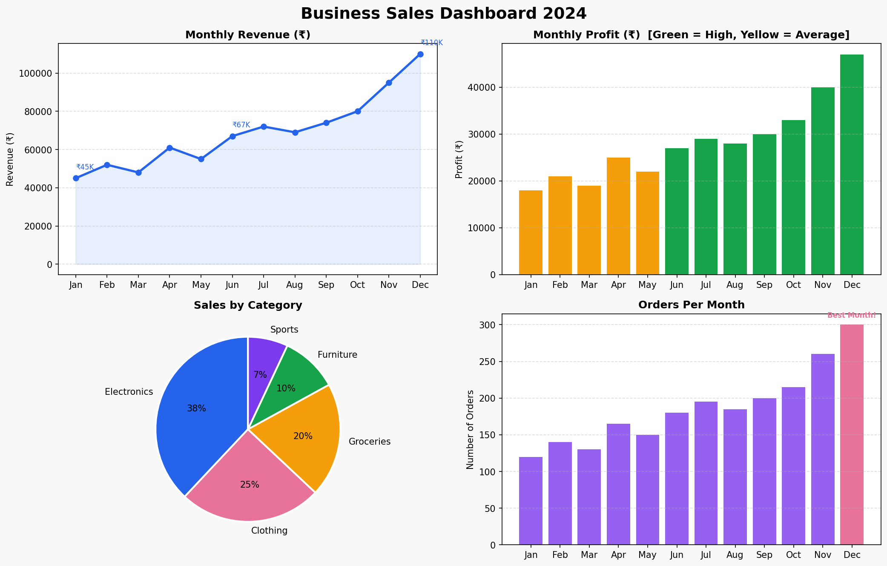

# 📊 Business Sales Analytics Dashboard

A beginner-friendly Python data analysis project that transforms raw sales numbers into a clean, visual 4-panel dashboard — built with Pandas and Matplotlib.

---

## Dashboard Preview



---

## Project Overview

This project analyzes 12 months of retail sales data across revenue, profit, orders, and product categories. It produces an executive-style dashboard with four charts and prints a quick business summary to the terminal.

**Built with:** Python · Pandas · Matplotlib

---

## What the Dashboard Shows

| Chart | What it Answers |
|---|---|
| Monthly Revenue Trend | Is the business growing month over month? |
| Monthly Profit Bar Chart | Which months were most profitable? |
| Sales by Category (Pie) | Which product category drives the most revenue? |
| Orders Per Month | When are customers buying the most? |

---

## How to Run This Project

### 1. Make sure Python is installed
```
python --version
```
If you see a version number, you're good. If not, download Python from python.org.

### 2. Install the required libraries
```
pip install pandas matplotlib
```

### 3. Run the script
```
python sales_dashboard_beginner.py
```

### 4. View your output
Two things will be created in your folder:
- `sales_dashboard.png` — the dashboard image
- Terminal output with total revenue, profit, orders, and best month

---

## Project Structure

```
sales-analytics-dashboard/
├── sales_dashboard_beginner.py   ← main Python script
├── sales_dashboard.png           ← generated dashboard output
└── README.md                     ← this file
```

---

## Key Business Insights from the Data

- Revenue grew by **144%** from January (₹45,000) to December (₹1,10,000), indicating strong year-end demand
- **November and December** are peak months — suggesting seasonal sales spikes ideal for inventory planning
- **Electronics (38%)** is the top-performing category by revenue share
- Profit margins remained healthy across all months, averaging **41%**

---

## Skills Demonstrated

- Data wrangling and structuring with **Pandas**
- Multi-panel data visualization with **Matplotlib**
- Business intelligence thinking — translating numbers into insights
- Clean, readable, well-commented Python code

---

*Dataset is synthetically generated for portfolio demonstration purposes.*